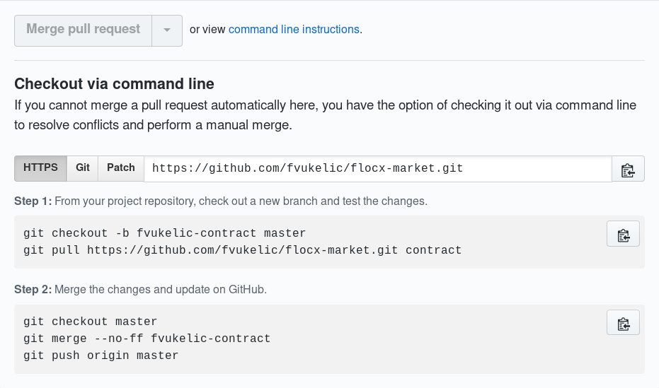

# FLOCX Git Tutorial

## Requirements and assumptions

### Git version

The output in this document was produced using Git version 2.21.0. If you are running something earlier, the output of `git status` and the information provided during a merge conflict may be somewhat more terse.

### Repository configuration

I am assuming that you started by forking an upstream repository on GitHub, and then cloned it to a local working directory by running:

```
git clone git@github.com:<your_user_id>/<repository_name>
```

This gives you a Git repository with a remote named `origin` pointing at your fork of the upstream repository:

```
$ git remote -v
origin  git@github.com:larsks/flocx-market.git (fetch)
origin  git@github.com:larsks/flocx-market.git (push)
```

You have a second remote named `upstream` pointing at the upstream repository that you created by running, e.g:

```
git remote add upstream https://github.com/<upstream_project>/<upstream_repository_name>
```

Giving you, for example:

```
$ git remote -v
origin  git@github.com:larsks/flocx-market.git (fetch)
origin  git@github.com:larsks/flocx-market.git (push)
upstream https://github.com/cci-moc/flocx-market.git (fetch)
upstream https://github.com/cci-moc/flocx-market.git (push)
```

## Always work on a branch (and give it a sensible name)

By always working on a branch, you will make life easier if you need to start work on an independent feature before your current work has merged. If you give your branches sensible names you will have an easier time remembering which branch you want as you switch between them.

Examples of sensible names:

- `convert-to-flask`
- `feature/oslo-config`
- `taiga/64`

Examples of less useful names:

- `dev`
- `newbranch`
- `fix`

## Rebase workflow

You've been plugging along working on your latest contribution. While you were busy working, someone else had the audacity to merge changes into master that will impact your work. You will need to incorporate those changes into your work before it can be merged. What do you do?

There are two options:

- Merging with `git merge`
- Rebasing with `git rebase`

When working on a pull request, you will almost always want to use `git rebase`. This leads to a cleaner history (making `git log` easier to read) and makes it easy to use features such as `git bisect`. To incorporate those new changes, you will first need to make sure your local copy of the upstream `master` branch is current by running:

```
git remote update
```

Now, rebase your current branch on top of that `master` branch. If your remote is named `upstream`, then you will run:

```
git rebase upstream/master
```

If there are no merge conflicts, you will see something like:

```
First, rewinding head to replay your work on top of it...
Applying: Hooks for default config file and business logic objects
```

Now you will want to update your remote branch (and the associated pull request, if one exists) by running:

```
git push -f
```

(The `-f` is short for `--force`, and this asks Git to **replace** the remote branch with the contents of your local branch.)

Now you can continue working on your new feature.

### Resolving merge conflicts

If there were merge conflicts, you would see something like this instead:

```
First, rewinding head to replay your work on top of it...
Applying: example commit for rebase worflow
Using index info to reconstruct a base tree...
M       flocx_market/conf/api.py
Falling back to patching base and 3-way merge...
Auto-merging flocx_market/conf/api.py
CONFLICT (content): Merge conflict in flocx_market/conf/api.py
error: Failed to merge in the changes.
Patch failed at 0001 example commit
hint: Use 'git am --show-current-patch' to see the failed patch
Resolve all conflicts manually, mark them as resolved with
"git add/rm <conflicted_files>", then run "git rebase --continue".
You can instead skip this commit: run "git rebase --skip".
To abort and get back to the state before "git rebase", run "git rebase --abort".
```

The `CONFLICT` line in the above output shows you what files failed to merge. If you forget, you can always run `git status` which will produce output like this:

```
rebase in progress; onto 2675f0d
You are currently rebasing branch 'rebase-example-1' on '2675f0d'.
  (fix conflicts and then run "git rebase --continue")
  (use "git rebase --skip" to skip this patch)
  (use "git rebase --abort" to check out the original branch)

Unmerged paths:
  (use "git reset HEAD <file>..." to unstage)
  (use "git add <file>..." to mark resolution)

        both modified:   flocx_market/conf/api.py

```

Git will mark up conflicting files to show the conflicting changes. In this case, I have introduced a comment into the file `flocx_market/conf/api.py` at the same place another commit wants to introduce a new line of code. Looking at file, we see:

```
def register_opts(conf):
    conf.register_opts(opts, group=api_group)
<<<<<<< HEAD
    conf.register_cli_opts(opts, group=api_group)
=======
    # This is an example.
>>>>>>> example commit for rebase workflow
```

There are several ways to resolve this situation:

1. Maybe we want both changes in the order in which they are presented, in which case we would simply remove the conflict markers, leaving us with content that looks like:

    ```
    def register_opts(conf):
        conf.register_opts(opts, group=api_group)
        conf.register_cli_opts(opts, group=api_group)
        # This is an example.
    ```

1. Maybe we want both changes, but the order needs to be corrected:

    ```
    def register_opts(conf):
        conf.register_opts(opts, group=api_group)
        # This is an example.
        conf.register_cli_opts(opts, group=api_group)
    ```

1. Maybe we only want one of the changes:

    ```
    def register_opts(conf):
        conf.register_opts(opts, group=api_group)
        conf.register_cli_opts(opts, group=api_group)
    ```

In any case, once we have update the file as necessary, we will need to `git add` it to tell Git we have finished resolving the conflict, after which we can continue the rebase:

```
git add flocx_market/conf/api.py
git rebase --continue
```

Once the rebase completes, we can update our remote branch:

```
git push -f
```

### Cancelling a rebase operation

Maybe you decide you rebased on the wrong thing, or maybe you're worried that you've screwed something up while rebasing. You can cancel an ongoing rebase operation by running:

```
git rebase --abort
```

This will restore the repository to the state it was in before you started the rebase operation.

## Fixing mistakes

### Fixing a mistake in the most recent commit

`git commit --amend` allows you to update the most recent commit in your repository. So for example, if after making a commit (or even after opening a pull request) you realize that you have made a typo, you can then:

1. Fix the typo
2. `git add` the modified files
3. Run `git commit --amend`

This will open up an editor allowing you to modify the commit message. Save the file and exit the editor and you're all set. At this point, you can update your remote repository (and your pull request) by running:

```
git push -f
```

If you only need to update the commit message, you can skip to step 3 above (just run `git commit --amend).

### Fixing a mistake in an older commit

What if you have multiple commits in a pull request and you find a mistake not in the most recent commit but in one of the earlier ones? You can use `git rebase` to make changes to that particular commit.

Consider a Git history that looks like this:

```
$ git log --oneline origin/master..
31931fa (HEAD -> feature/commit-checks, larsks/feature/commit-checks) Skip commit checks for fixup commits
cef9289 Add pre-commit and commit-msg hooks to repository
2425a02 Teach flakeight.sh to check only staged changes
732706c Teach test_commit.py about --message-from-file
```

You realize you have a typo in the code that is part of `2425a02`. Start an interactive rebase from the parent of that commit, like this:

```
git rebase -i 2425a02^
```

The syntax `<commit_id>^` means "the first parent of the named commit". This will bring up a "pick list" in your editor:

```
pick 2425a02 Teach flakeight.sh to check only staged changes
pick cef9289 Add pre-commit and commit-msg hooks to repository
pick 31931fa Skip commit checks for fixup commits

# Rebase 732706c..31931fa onto 732706c (3 commands)
#
# Commands:
.
.
.
```

Change `pick` to `edit` on commit `2425a02` so that your pick list looks like:

```
edit 2425a02 Teach flakeight.sh to check only staged changes
pick cef9289 Add pre-commit and commit-msg hooks to repository
pick 31931fa Skip commit checks for fixup commits
```

Save and exit the editor. You should see a message like:

```
Stopped at 2425a02... Teach flakeight.sh to check only staged changes
You can amend the commit now, with

  git commit --amend

Once you are satisfied with your changes, run

  git rebase --continue
```

At this point, make any changes necessary to the commit, then `git add` the modified files. You can run `git rebase --continue` if you are done making changes, or `git commit --amend` followed by `git rebase --continue` if you need to update the commit message.

### But what if you have unstaged changes?

`git rebase` won't work if you have unstaged changes in your working directory. An "unstaged change" means a modification to a file that has previously been added to the repository. You have a few options for resolving this situation:

1. You can create a new commit that includes the changes.

1. You can use the `git stash` command to save the changes to a temporary location (and then later use `git stash pop` to restore those changes.

## Working on multiple pull requests

You will at times find yourself needing to start a new pull request before the one you are currently working on has merged.  In this section, we will look at a few variations on this situation and how to address them.

### Working on two independent changes

If you're working on two features that don't relate to each other at all (neither depend on each other nor modify the same files), it's easy.  Just make sure your remotes are up to date:

```
git remote update
```

And start a new branch from `upstream/master` for your next feature:

```
git checkout -b add-new-widget upstream/master
```

### Working on two related changes

If you are writing a new feature that depends on code you currently have up for review, you can create a new branch from your existing feature branch. Let's assume you have a branch `feature-1` that looks like:

```
$ git checkout feature-1
$ git log -1
commit 858500661b4358e8a37a0e36b3b16af491157a9c (feature-1)
Author: Lars Kellogg-Stedman <lars@redhat.com>
Date:   Tue Jul 2 23:56:59 2019 -0400

    Add feature 1

    this commit adds feature 1 (and is a terrible example of what a 
    commit message should look like).
```

If you want to add a new feature that requires the work in `feature-1`, you would start by creating a new branch (called, say, `feature-2`):

```
git checkout -b feature-2 feature-1
```

While working on your new `feature-2` branch it's possible that you will need to make changes to your `feature-1` branch as a result of the code review process.  First, check out your `feature-1` branch:

```
git checkout feature-1
```

Make any necessary changes and add the changes to your repository:

```
git add ...changed files...
```

And then decide whether you are going to update an existing commit (using e.g. `git commit --amend`) or if you are going to create a new commit.

#### If you create a new commit

After you create a new commit (by running `git commit`), check out your `feature-2` branch:

```
git checkout feature-2
```

And rebase it on `feature-1`:

```
git rebase feature-1
```

#### If you amend an existing commit

After you update an existing commit (by using `git commit --amend`), you will need to perform an [interactive rebase][] of `feature-2` on top of `feature-1`.  Start by checking out `feature-2`:

```
git checkout feature-2
```

If at this point you were to simply run `git rebase feature-1` as in the previous example, you would end up with a merge conflict. Why? Because you are effectively creating a history that looks like this:

```
$ git log --oneline -3
9fd3b8c (HEAD -> feature-2) Add feature 2
8585006 (feature-1) Add feature 1
0ff1ce0 (feature-1) Add feature 1
```

That is, you would find both the old and the new version of the `Add feature 1` commit in your history. Since in most cases both commits will include changes to the same lines in the same files, they cannot both be applied.

You can fix this by instead performing an interactive rebase:

```
git rebase -i feature-1
```

This will bring up a pick list (remember that?) showing the commits on your current `feature-2` branch that aren't in `feature-1`:

```
pick 8585006 Add feature 1
pick 9fd3b8c Add feature 2
```

Delete the old version of `Add feature 1` so that your pick list looks like:

```
pick 9fd3b8c Add feature 2
```

Save and exit your editor, and the rebase should complete successfully.

### Working on top of someone else's unmerged pull request

Using GitHub's instructions:



Or slightly simpler if you don't actually need to check out the branch:

```
git fetch https://github.com/fvukelic/flocx-market.git +contract:fvukelic-contract
```

<!--
## Better living through git hooks

You can save time and frustration by running validation checks locally *before* submitting a pull request. If this is manual step, you'll forget to do it (at least *I* forget to do it) and end up having a pull request fail validation because of a silly typo or something.

You can configure the validation checks to run automatically by setting up [git hooks][]. These are scripts that Git will run automatically in response to various changes in the repository.

### Hooks of interest

Git looks for hook scripts in the `.git/hooks` directory. Of particular interest are the following:

#### pre-commit

> The `pre-commit` hook is run first, before you even type in a commit message. It's used to inspect the snapshot that's about to be committed, to see if you've forgotten something, to make sure tests run, or to examine whatever you need to inspect in the code. Exiting non-zero from this hook aborts the commit, although you can bypass it with git commit --no-verify. You can do things like check for code style (run lint or something equivalent), check for trailing whitespace (the default hook does exactly this), or check for appropriate documentation on new methods. (from [Pro Git][])

We can use the `pre-commit` hook to run the `pep8` check, which validates the correct formatting of our Python source files.

#### commit-msg

> The commit-msg hook takes one parameter, which again is the path to a temporary file that contains the commit message written by the developer. If this script exits non-zero, Git aborts the commit process, so you can use it to validate your project state or commit message before allowing a commit to go through. (from [Pro Git][])

We can use the `commit-msg` hook to run our commit style checks.

### Installing the hooks

You will find suitable hook scripts in the `scripts/hooks` directory of the [flocx-market][] repository. You can manually install these into your `.git/hooks` directory, or you can run the `./scripts/setup-hooks.sh` script.

[pro git]: https://git-scm.com/doc
[git hooks]: https://git-scm.com/book/en/v2/Customizing-Git-Git-Hooks
[flocx-market]: https://github.com/cci-moc/flocx-market
-->
